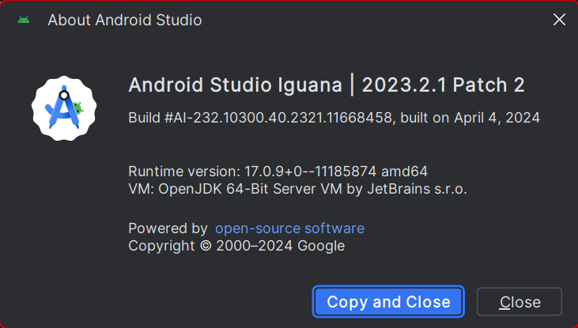
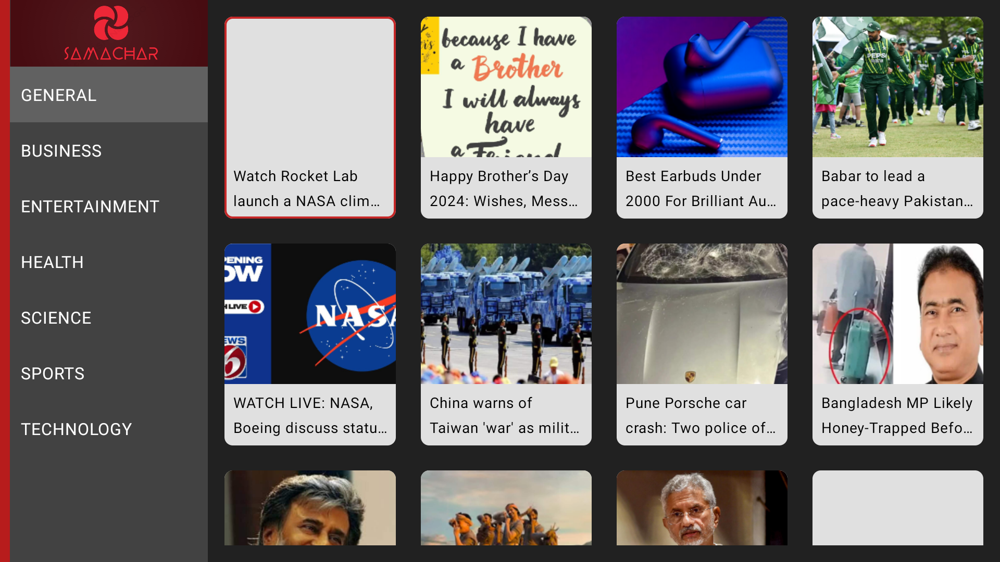
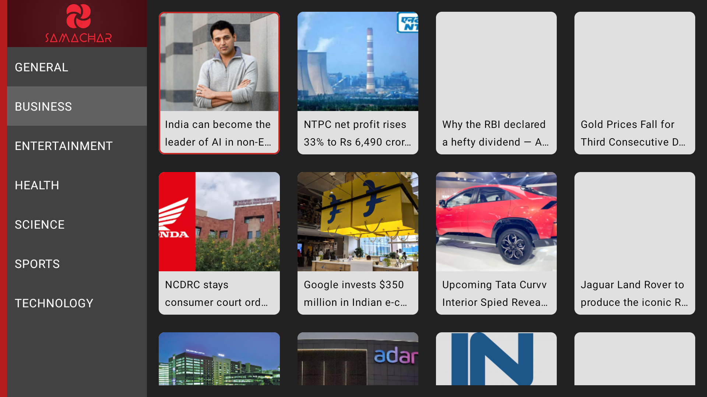
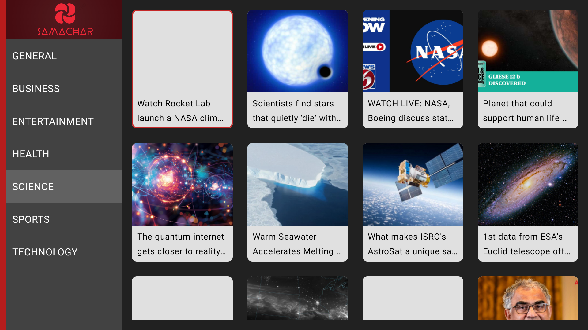
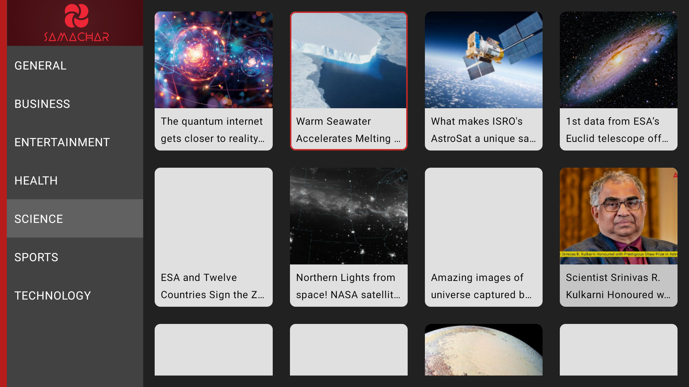
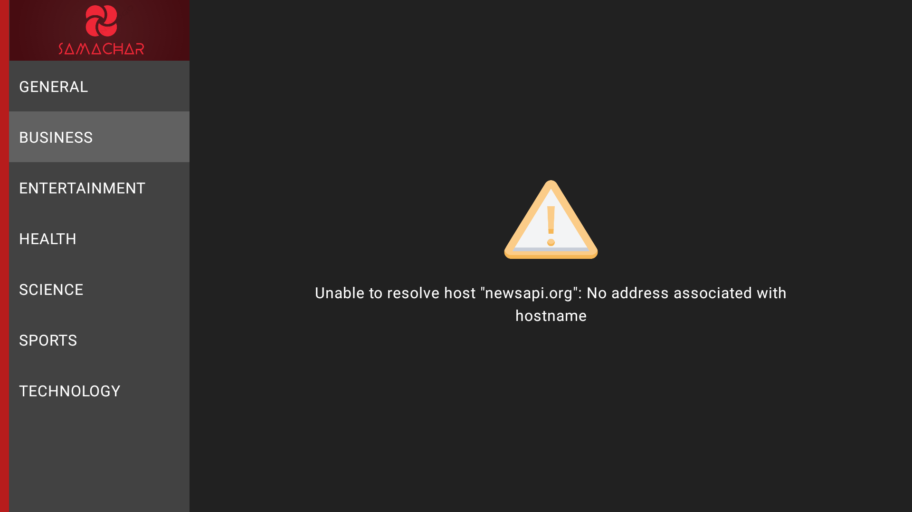

# News24Hour

<u>Description:</u>

This TV application <u>provides</u> users with a convenient and up-to-date way to stay informed about current events and happenings around the world. Users receive real-time notifications for breaking news stories so you can stay ahead of the curve. The intuitive navigation and a sleek design make it easy to find the information you're looking for.

<u>Installation:</u>

To run the app you just need an android studio. I'll add the version which I used to create in the screenshot. The latest version of android studio will be a good option.

Android Studio Information:

<u>Project Structure:</u>
1. Architecure: MVVM with repository pattern.
2. Ktor for making async api calls.
3. Hilt for dependency injection.
4. Compose for UI layouts
5. Coil for image downloading

<u>Features:</u>

This app has various categories of news like health, sports, business but they are only limited to India as of now. News of other countries are under dev. Please stay tuned.

<u>Screenshots</u>
Screen shot 1:

Screen shot 2:

Screen shot 3:

Screen shot 4:

Screen shot 5:

